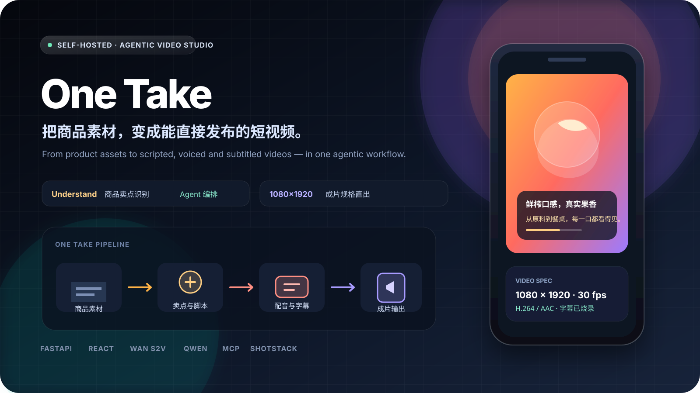
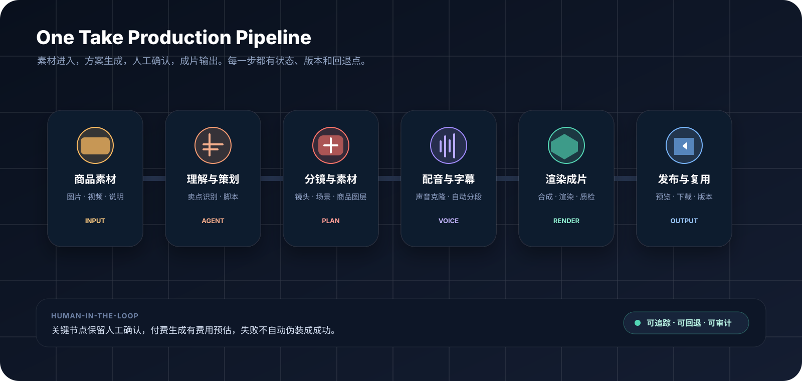
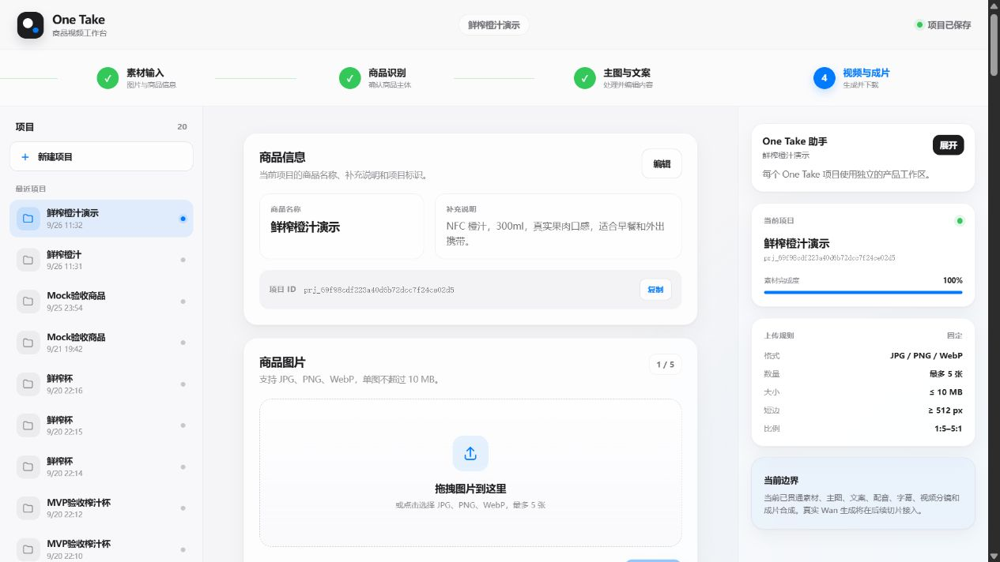
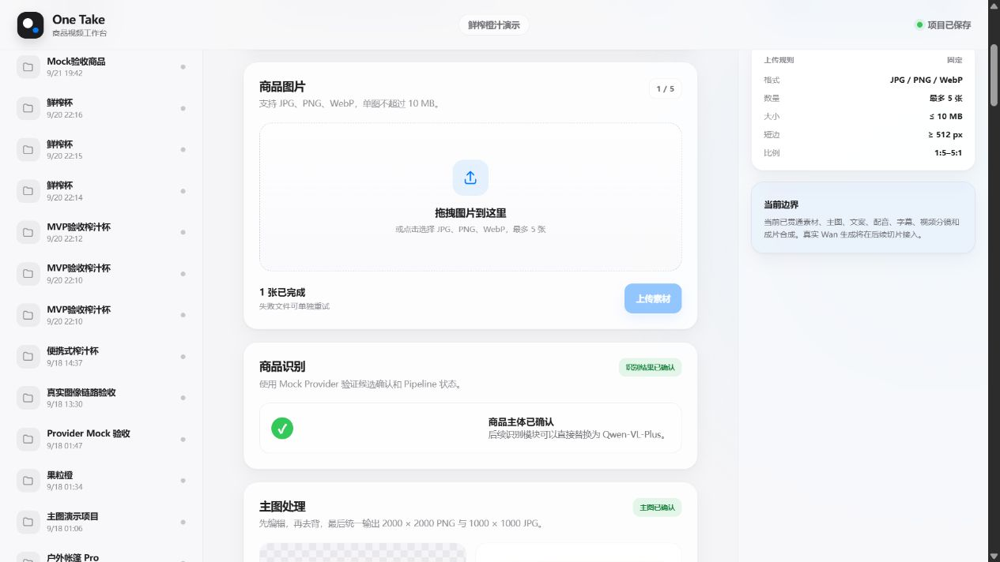
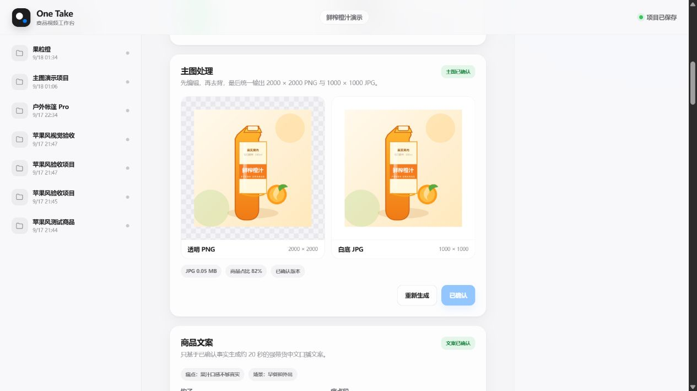
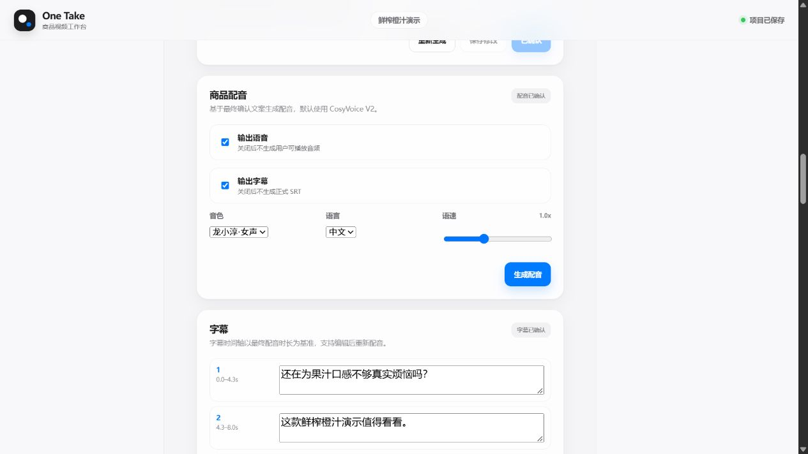
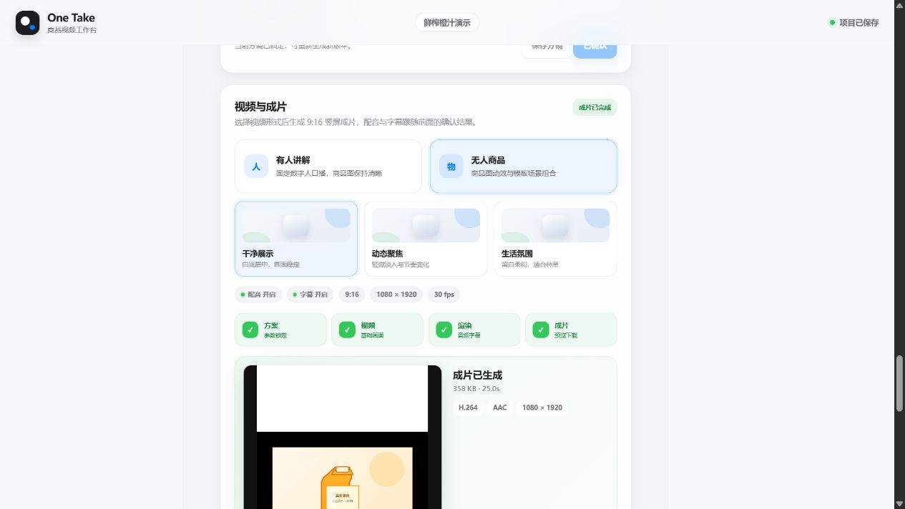
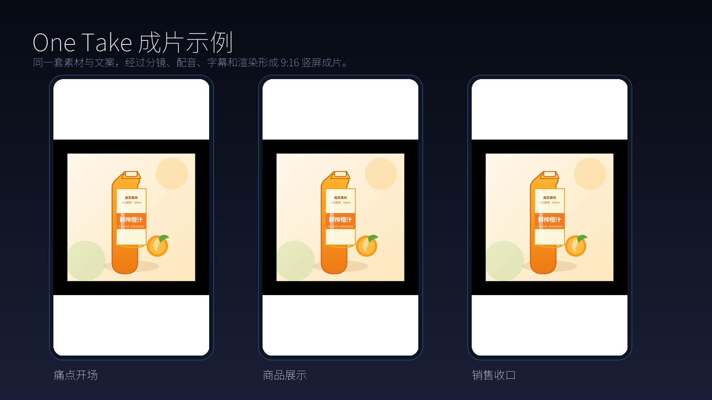
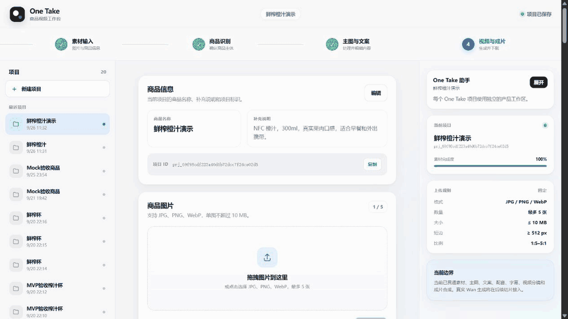

<p align="center">
  
</p>

<h1 align="center">One Take</h1>

<p align="center">
  <strong>把商品素材，变成能直接发布的短视频。</strong><br />
  从商品理解、脚本分镜、配音字幕到成片输出，一条可追踪、可回退的 Agent 生产线。
</p>

<p align="center">
  <a href="#-quick-start"></a>
  <a href="docs/架构设计.md"></a>
  <a href="#-roadmap"></a>
</p>

<p align="center">
  
  
  
  
  
  
  
</p>

<p align="center">
  <sub>One Take is a self-hosted AI product video studio. Product assets in. Script, voice, captions and final video out.</sub>
</p>

## 🌟 为什么做 One Take

电商短视频的问题通常不是“没有 AI 模型”，而是中间流程全部断裂：

- 商品图、卖点和补充说明散落在不同工具里。
- 识别、文案、配音、字幕和视频生成各自为政。
- AI 生成内容缺少人工确认、版本记录和失败回退。
- 真实付费链路与 Mock 结果容易混在一起。
- 每次生成都像重新开始，不能形成稳定、可复用的生产流程。

One Take 把这些问题收进一个工作台：

> **一个项目 = 一套素材、一套事实、一套脚本、一套声音、一套视频版本和一条可追踪的生产记录。**

## 🎬 从商品素材到成片

<p align="center">
  
</p>

## ✨ 核心能力

| 能力 | 解决的问题 | One Take 的做法 |
|---|---|---|
| 商品理解 | 商品图信息不足、卖点混乱 | Qwen-VL 识别、候选确认、事实快照与数字校验 |
| 图片处理 | 商品图风格不统一、背景杂乱 | 图像编辑、智能去背、主图标准化和人工复核 |
| 内容策划 | 不会写脚本、分镜没有结构 | 结构化内容方案、分镜、Prompt Schema 和 Style Profile |
| 配音字幕 | 声音和字幕各做一遍，格式容易错 | CosyVoice 配音、SRT 时间轴、中文字幕烧录和编辑确认 |
| 视频生成 | 模型、模板和合成链路难维护 | Adapter 隔离真实/Mock Provider，Shotstack 与本地合成可切换 |
| Agent 协作 | 每次对话都缺少项目上下文 | 每个项目独立 Workspace，支持 Memory、Scheduler、MCP 和受控写工具 |
| 费用与安全 | 不小心触发付费调用 | `MOCK_PROVIDERS` 安全锁、费用预估、人工审批和失败不自动伪装成功 |
| 成片卡口 | 输出规格不稳定 | 1080×1920、18–25 秒、30 fps、H.264/AAC、30 MB 上限 |

## 🖥️ 产品界面

### 一个项目贯穿完整生产流程

<p align="center">
  
</p>

左侧管理项目，中间完成素材、内容、配音、字幕和视频生产，右侧显示产品工作区与 Agent 能力。

| 素材与商品识别 | 主图与内容策划 |
|---|---|
|  |  |
| 商品图上传、校验、识别候选和人工确认。 | 主图处理、事实确认、脚本编辑和内容版本管理。 |

| 配音与字幕 | 视频方案与成片 |
|---|---|
|  |  |
| 音色、语速、音频试听、字幕分段和时间轴编辑。 | 视频模式、模板、生成进度、成片预览和 MP4 下载。 |

## 🎬 成片展示

<p align="center">
  
</p>

## 🎞️ 工作流演示

<p align="center">
  
</p>

## 🚀 Quick Start

### 1. 启动 One Take Core

```powershell
Copy-Item .env.example .env
docker compose up -d --build api worker mcp
```

启动后：

- API 文档：http://localhost:8000/docs
- Provider 状态：http://localhost:8000/api/v1/providers/status
- MCP：http://localhost:8010/mcp
- MinIO Console：http://localhost:9001

### 2. 启动 One Take 产品后端

另开一个 PowerShell：

```powershell
cd platform/one-take-backend
npm install
$env:ONETAKE_MCP_URL = "http://127.0.0.1:8010/mcp"
$env:ONETAKE_MCP_TOKEN = "<与 One Take MCP 配置一致>"
$env:ONETAKE_API_URL = "http://127.0.0.1:8000"
npm run dev:backend
```

### 3. 启动产品 Web

再开一个 PowerShell：

```powershell
cd platform/one-take-backend
npm --prefix web install
npm --prefix web run dev
```

访问：http://localhost:5173

## 🧱 架构

```text
One Take Web
    │
    ├─ /api/*              → One Take Core API
    ├─ /miniclaw-api/*     → One Take 产品后端
    └─ /miniclaw-ws/*      → One Take 产品后端事件流

One Take Core API
    ├─ PostgreSQL          项目、素材、Pipeline、Outbox
    ├─ Redis / RQ          Worker 队列与异步任务
    ├─ MinIO               媒体对象存储
    ├─ Provider Adapters   AI、渲染、配音和字幕能力
    └─ MCP Bridge          受控的只读与人工审批写工具

One Take Agent Platform
    ├─ Workspace           每个项目一个隔离工作区
    ├─ Session             会话、流式输出、取消和恢复
    ├─ Memory / Skills     项目级上下文和可复用能力
    ├─ Scheduler           定时任务和后台运行
    └─ Channels            Web、MCP 和消息渠道统一接入
```

## 📁 仓库结构

```text
OneTake/
├─ apps/
│  ├─ api/                         # One Take 核心 FastAPI 服务
│  ├─ worker/                      # RQ Worker 与媒体处理任务
│  ├─ mcp/                         # One Take 受控 MCP Bridge
│  └─ web/                         # 已冻结的旧版 Web，仅用于回退
├─ platform/
│  └─ one-take-backend/            # 产品后端、Agent Runtime 与当前产品 Web
├─ assets/readme/                  # GitHub 首页视觉素材
├─ docs/                           # 架构、方案档案和验收报告
├─ infra/                          # 数据库与基础设施配置
├─ scripts/                        # 开发和验收脚本
└─ docker-compose.yml              # One Take 核心服务编排
```

## 🧪 开发与测试

One Take Core：

```powershell
docker compose exec -T api pytest -q
```

产品后端：

```powershell
cd platform/one-take-backend
npm run typecheck
npm test -- --run
```

产品 Web：

```powershell
cd platform/one-take-backend
npm --prefix web run test:run
npm --prefix web run build
```

## 🔐 Provider 模式

默认启用 Mock，不产生付费调用。真实 Provider 必须显式关闭 Mock 安全锁并配置凭据；密钥只放 `.env`，不进入 Git。

```env
MOCK_PROVIDERS=true
RECOGNITION_PROVIDER=mock
IMAGE_EDIT_PROVIDER=mock
MATTING_PROVIDER=mock
SCRIPT_PROVIDER=mock
AVATAR_VIDEO_PROVIDER=mock
```

真实 Provider 失败不会自动回退 Mock，避免把 Mock 结果误认为真实结果。

## 🛡️ 质量与安全边界

- 图片、视频、音频和字幕在进入下一步之前都有状态与确认点。
- 付费生成必须先看到费用预估，并通过人工审批。
- 外部 Provider 有超时、重试、结果校验和失败隔离。
- 媒体按项目隔离，支持立即删除和定时清理。
- 可追踪、可回退、可审计优先于“看起来已经成功”。

## 🗺️ Roadmap

- [x] One Take Core Pipeline
- [x] Mock 全流程验收
- [x] 真实 Provider Adapter
- [x] 项目级 Agent Workspace
- [x] 单一产品 Web 与 GitHub 单仓库发布
- [ ] 更稳定的真实链路质量评分
- [ ] 多模板批量生成
- [ ] 更完整的作品展示与模板市场
- [ ] 英文文档与公开 Demo

## 📚 文档

- [架构设计](docs/架构设计.md)
- [方案档案](docs/方案档案.md)
- [仓库结构与开发说明](docs/仓库结构与开发说明.md)
- [MVP 验收报告](docs/MVP验收报告.md)
- [真实 S2V 启用手册](docs/真实S2V启用手册.md)
- [MCP Bridge](apps/mcp/README.md)

## 🤝 Contributing

欢迎提交 Issue、想法、Adapter、模板和文档改进。

- 一个改动保持一个明确范围。
- 先写可复现问题，再提交修复。
- 不提交 `.env`、密钥、用户素材和生成数据。
- 不删除历史标签和回退路径。
- 每个涉及 Pipeline 的改动必须能解释费用、质量和回退影响。

## 📄 License

One Take 产品代码沿用仓库中的许可证。`platform/one-take-backend/` 保留其原始 MIT License 和版权声明。